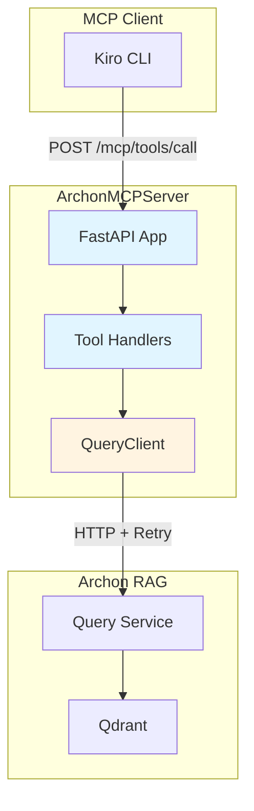
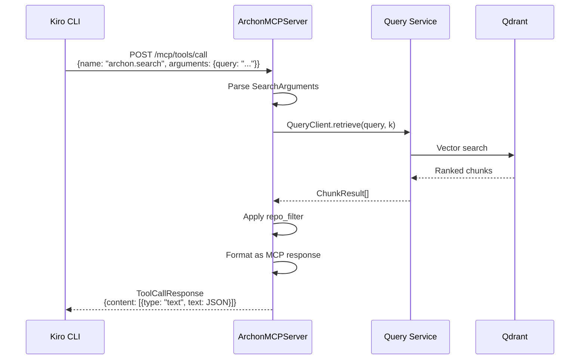
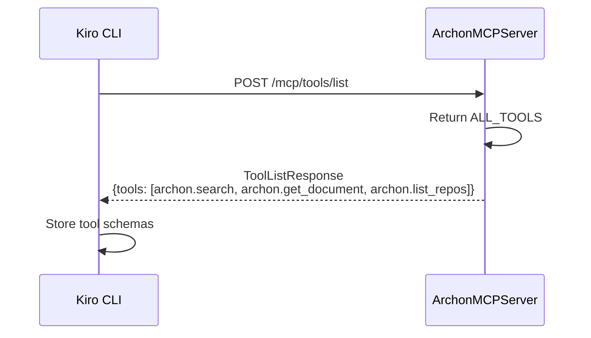
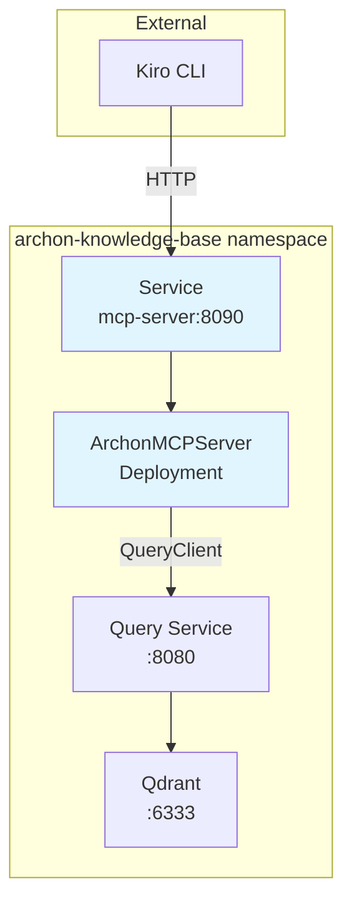

# Architecture

## System Design

ArchonMCPServer is a stateless HTTP server that translates MCP protocol requests into Archon Query Service calls. It acts as an adapter between MCP clients (Kiro, Claude Desktop) and the existing RAG infrastructure.

## Components

### 1. FastAPI Application

HTTP server exposing MCP endpoints.

**Responsibilities:**
- Serve `/health` for health checks
- Serve `/mcp/tools/list` to advertise available tools
- Serve `/mcp/tools/call` to invoke tools
- Handle errors and return MCP-compliant responses

**Configuration:**
- `QUERY_SERVICE_URL`: URL of Query Service (default: `http://query.archon-knowledge-base:8080`)
- Port: 8090

### 2. Tool Handlers

Functions that implement each MCP tool.

**archon.search Handler:**
- Parses `SearchArguments` from request
- Calls `QueryClient.retrieve(query, k)`
- Transforms results to `ChunkResult` format with provenance
- Applies `repo_filter` if specified
- Returns JSON response

**archon.get_document Handler:**
- Parses `GetDocumentArguments` from request
- TODO: Retrieves full document from Qdrant or document store
- Returns `DocumentResponse` with full content

**archon.list_repos Handler:**
- TODO: Queries metadata store for repository list
- Currently returns hardcoded list of 6 Archon repos
- Returns `ListReposResponse` with repo info

### 3. QueryClient Wrapper

Uses `AphexServiceClients.QueryClient` to communicate with Query Service.

**Features:**
- Automatic retry with exponential backoff (5 attempts, 1-60s wait, 0-5s jitter)
- Async context manager for connection lifecycle
- Timeout: 30 seconds per request

### 4. MCP Protocol Models

Pydantic models for MCP request/response validation.

**Core Models:**
- `Tool`: Tool definition with name, description, inputSchema
- `ToolListResponse`: List of available tools
- `ToolCallRequest`: Tool invocation request
- `ToolCallResponse`: Tool invocation response

**Tool-Specific Models:**
- `SearchArguments`, `SearchResponse`, `ChunkResult`
- `GetDocumentArguments`, `DocumentResponse`
- `ListReposResponse`, `RepoInfo`

### 5. Tool Definitions

Static tool metadata advertised to MCP clients.

**ARCHON_SEARCH:**
- Name: `archon.search`
- Description: Search across internal Archon/Aphex documentation
- Parameters: query (required), top_k (optional), repo_filter (optional)

**ARCHON_GET_DOCUMENT:**
- Name: `archon.get_document`
- Description: Fetch full document text for a doc_id
- Parameters: doc_id (required)

**ARCHON_LIST_REPOS:**
- Name: `archon.list_repos`
- Description: List available repositories
- Parameters: none

## Data Flow

### Search Request Flow

### Tool Discovery Flow

## Technology Stack

- **Python 3.11+**: Runtime
- **FastAPI 0.115.0+**: HTTP framework with automatic OpenAPI docs
- **Uvicorn 0.32.0+**: ASGI server with standard extras (websockets, httptools)
- **AphexServiceClients 0.1.0+**: Query Service client
- **Pydantic 2.0.0+**: Request/response validation

## Architectural Patterns

### Adapter Pattern

ArchonMCPServer adapts the Query Service API to the MCP protocol without changing either system.

**Benefits:**
- Decouples MCP clients from Query Service implementation
- Allows Query Service to evolve independently
- Enables multiple protocol adapters (could add GraphQL, gRPC, etc.)

### Stateless Design

Server maintains no session state between requests.

**Benefits:**
- Horizontal scaling without coordination
- Simple deployment and restart
- No state synchronization complexity

**Trade-off:** Cannot cache results across requests (could add Redis later).

### Thin Wrapper Philosophy

Minimal logic between MCP protocol and Query Service.

**Benefits:**
- Easy to understand and maintain
- Low latency overhead
- Reuses existing retry and error handling

**Trade-off:** Limited ability to optimize or transform results.

## Dependencies

### Upstream Dependencies

**Query Service (port 8080):**
- Provides retrieval API via `QueryClient`
- Required for archon.search tool
- Co-located in archon-knowledge-base namespace

**Qdrant 1.16.3:**
- Vector database with 768-dim embeddings
- Accessed indirectly via Query Service
- Required for all retrieval operations

**AphexServiceClients:**
- Python package providing QueryClient
- Handles HTTP communication and retry logic
- Version: 0.1.0+

### Downstream Dependencies

**Kiro CLI:**
- Primary consumer via archon-rag.md steering
- Calls MCP endpoints when working on Archon/Aphex code
- Requires HTTP access to port 8090

**Claude Desktop (optional):**
- Can be configured to use ArchonMCPServer
- Requires MCP server configuration in settings

**Cursor (optional):**
- Can be configured to use ArchonMCPServer
- Requires MCP server configuration

## Deployment Architecture

**Namespace:** `archon-knowledge-base` (co-located with Query Service and Qdrant)

**Service:** `mcp-server.archon-knowledge-base:8090`

**Deployment:** Single replica (stateless, can scale horizontally)

**Source**
- `src/archon_mcp/server.py` - FastAPI app and handlers
- `src/archon_mcp/models.py` - Pydantic models
- `src/archon_mcp/tools.py` - Tool definitions
- `Dockerfile` - Container image
- `pyproject.toml` - Dependencies
