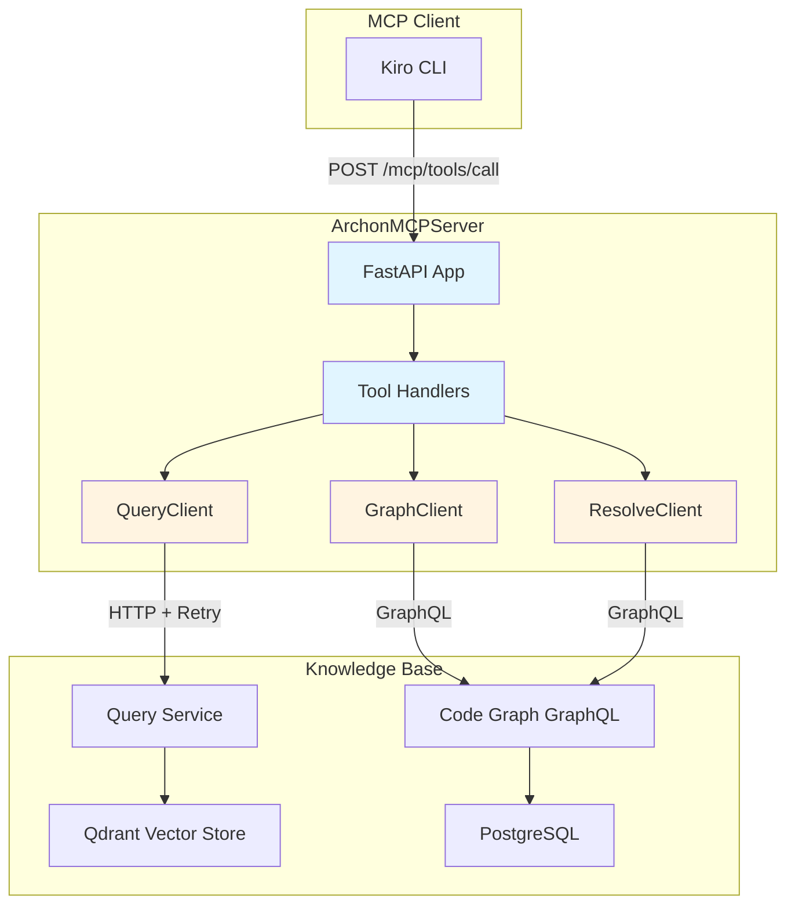
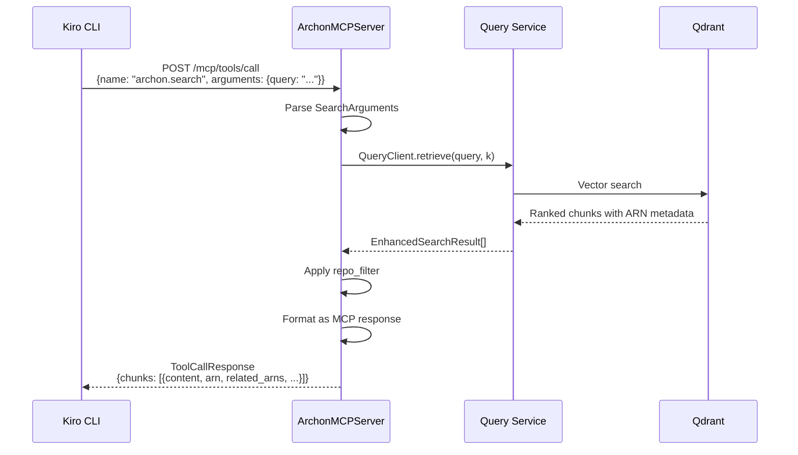
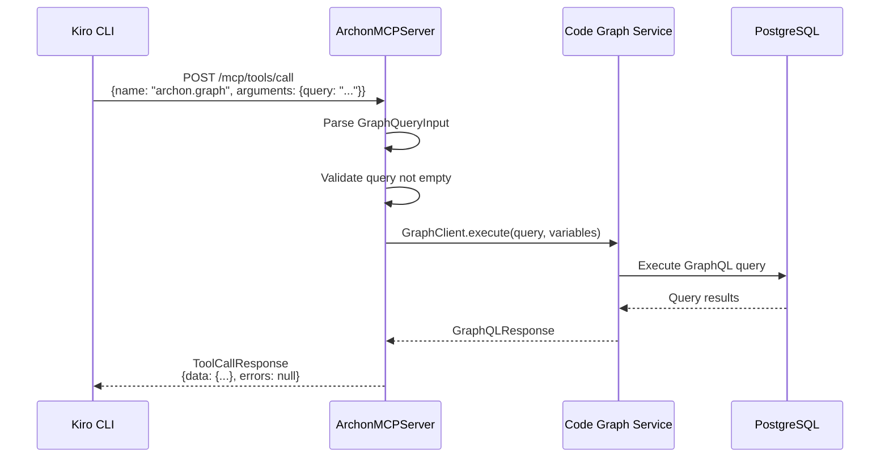
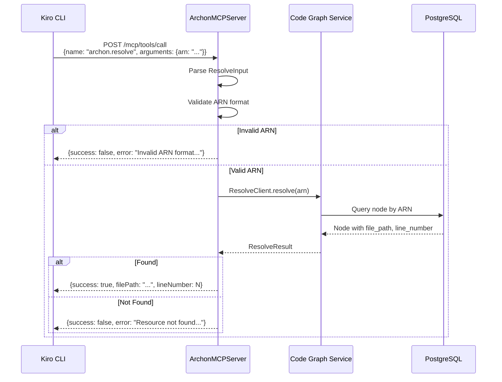
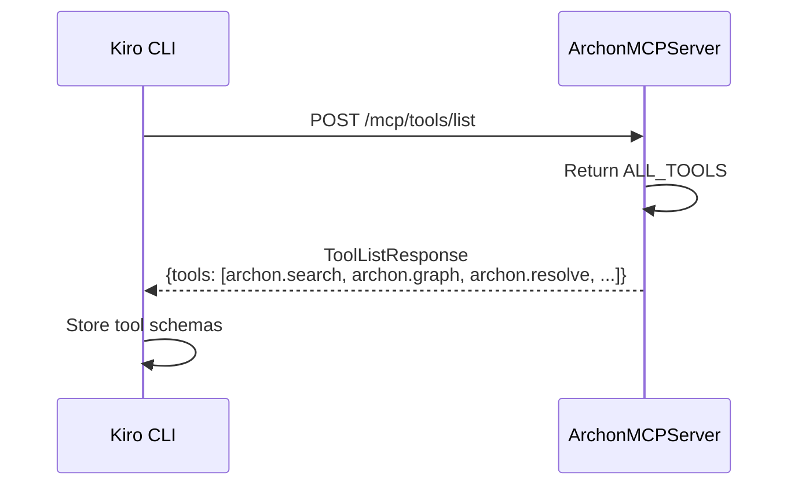
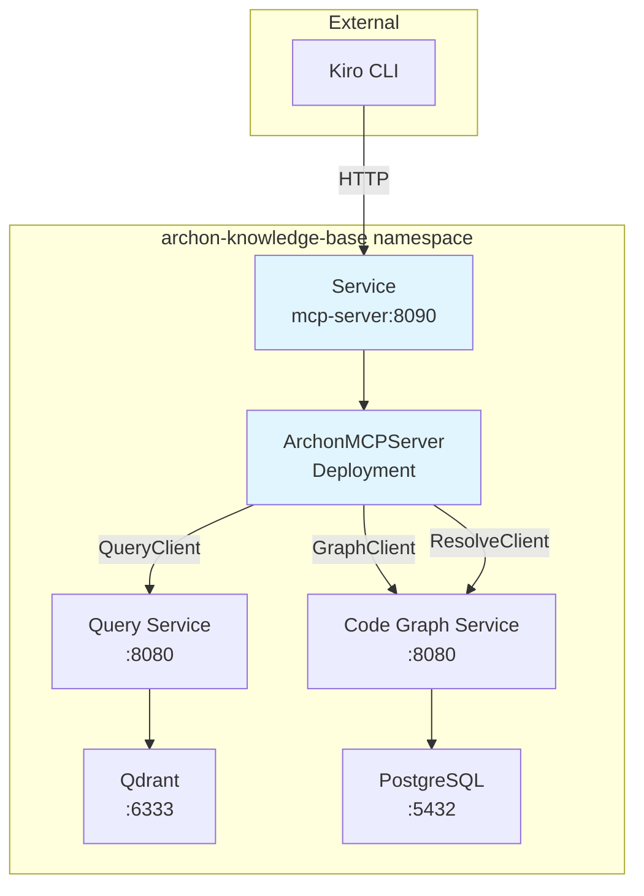

# Architecture

## System Design

ArchonMCPServer is a stateless HTTP server that translates MCP protocol requests into backend service calls. It acts as an adapter between MCP clients (Kiro, Claude Desktop) and the knowledge base infrastructure, providing semantic search, code graph queries, and ARN resolution.



## Knowledge Base Integration

ArchonMCPServer connects to the knowledge base infrastructure to provide three key capabilities:

### Semantic Search with ARN Metadata

The `archon.search` tool queries the Qdrant vector store via the Query Service. Search results include ARN metadata that enables navigation to the Code Graph for relationship traversal.

```
Search Query → QueryClient → Query Service → Qdrant → EnrichedSearchResult
                                                        ├── content
                                                        ├── source
                                                        ├── score
                                                        ├── arn
                                                        ├── related_arns
                                                        └── symbol_name/kind
```

### Code Graph Queries

The `archon.graph` tool proxies GraphQL queries to the Code Graph service, enabling relationship traversal and code navigation.

```
GraphQL Query → GraphClient → Code Graph Service → PostgreSQL → GraphQL Response
                                                                  ├── data
                                                                  └── errors
```

### ARN Resolution

The `archon.resolve` tool resolves ARNs to file locations by querying the Code Graph.

```
ARN → ResolveClient → Code Graph Service → PostgreSQL → ResolveResult
                                                          ├── filePath
                                                          └── lineNumber
```

## Components

### 1. FastAPI Application

HTTP server exposing MCP endpoints.

**Responsibilities:**
- Serve `/health` for health checks
- Serve `/mcp/tools/list` to advertise available tools
- Serve `/mcp/tools/call` to invoke tools
- Handle errors and return MCP-compliant responses

**Configuration:**
- `QUERY_SERVICE_URL`: URL of Query Service (default: `http://query.archon-knowledge-base:8080`)
- Port: 8090

### 2. Tool Handlers

Functions that implement each MCP tool.

**archon.search Handler (Enhanced):**
- Parses `SearchArguments` from request
- Calls `QueryClient.retrieve(query, k)`
- Transforms results to `EnhancedSearchResult` format with ARN metadata
- Applies `repo_filter` if specified
- Returns JSON response with chunks containing ARN, related_arns, symbol_name, symbol_kind, package

**archon.graph Handler:**
- Parses `GraphQueryInput` from request
- Validates GraphQL query is not empty
- Calls `GraphClient.execute(query, variables)`
- Returns GraphQL response with data and errors

**archon.resolve Handler:**
- Parses `ResolveInput` from request
- Validates ARN format before resolution
- Calls `ResolveClient.resolve(arn)`
- Returns success with filePath/lineNumber or error message

**archon.get_document Handler:**
- Parses `GetDocumentArguments` from request
- TODO: Retrieves full document from Qdrant or document store
- Returns `DocumentResponse` with full content

**archon.list_repos Handler:**
- TODO: Queries metadata store for repository list
- Currently returns hardcoded list of 6 Archon repos
- Returns `ListReposResponse` with repo info

### 3. QueryClient Wrapper

Uses `AphexServiceClients.QueryClient` to communicate with Query Service.

**Features:**
- Automatic retry with exponential backoff (5 attempts, 1-60s wait, 0-5s jitter)
- Async context manager for connection lifecycle
- Timeout: 30 seconds per request

### 4. GraphClient (Code Graph)

Client for the Code Graph GraphQL API, enabling relationship traversal and code navigation.

**Features:**
- Async context manager for connection lifecycle
- GraphQL query execution with variables support
- Structured error handling for validation and service errors
- Timeout: 30 seconds per request

**Configuration:**
- `GRAPH_SERVICE_URL`: URL of Code Graph service (default: `http://graph.archon-knowledge-base:8080`)

### 5. ResolveClient (ARN Resolution)

Client for resolving ARNs to file locations via the Code Graph.

**Features:**
- ARN format validation before resolution
- Async context manager for connection lifecycle
- Structured error responses for not found and service errors
- Timeout: 10 seconds per request

### 6. MCP Protocol Models

Pydantic models for MCP request/response validation.

**Core Models:**
- `Tool`: Tool definition with name, description, inputSchema
- `ToolListResponse`: List of available tools
- `ToolCallRequest`: Tool invocation request
- `ToolCallResponse`: Tool invocation response

**Tool-Specific Models:**
- `SearchArguments`, `SearchResponse`, `ChunkResult`, `EnhancedSearchResult`
- `GetDocumentArguments`, `DocumentResponse`
- `ListReposResponse`, `RepoInfo`
- `GraphQueryInput`, `GraphQueryOutput`, `GraphQLError`
- `ResolveInput`, `ResolveOutput`
- `ARNValidationResult`

### 7. Tool Definitions

Static tool metadata advertised to MCP clients.

**ARCHON_SEARCH (Enhanced):**
- Name: `archon.search`
- Description: Search across internal Archon/Aphex documentation with ARN metadata
- Parameters: query (required), top_k (optional), repo_filter (optional)
- Returns: Chunks with ARN metadata for graph traversal

**ARCHON_GRAPH:**
- Name: `archon.graph`
- Description: Execute GraphQL queries against the Code Graph
- Parameters: query (required), variables (optional)
- Returns: GraphQL response with data and errors

**ARCHON_RESOLVE:**
- Name: `archon.resolve`
- Description: Resolve an ARN to its file location
- Parameters: arn (required)
- Returns: File path and line number

**ARCHON_GET_DOCUMENT:**
- Name: `archon.get_document`
- Description: Fetch full document text for a doc_id
- Parameters: doc_id (required)

**ARCHON_LIST_REPOS:**
- Name: `archon.list_repos`
- Description: List available repositories
- Parameters: none

## Data Flow

### Search Request Flow (Enhanced)



### Graph Query Flow



### ARN Resolution Flow



### Tool Discovery Flow



## Technology Stack

- **Python 3.11+**: Runtime
- **FastAPI 0.115.0+**: HTTP framework with automatic OpenAPI docs
- **Uvicorn 0.32.0+**: ASGI server with standard extras (websockets, httptools)
- **AphexServiceClients 0.1.0+**: Query Service client
- **Pydantic 2.0.0+**: Request/response validation

## Architectural Patterns

### Adapter Pattern

ArchonMCPServer adapts the Query Service API to the MCP protocol without changing either system.

**Benefits:**
- Decouples MCP clients from Query Service implementation
- Allows Query Service to evolve independently
- Enables multiple protocol adapters (could add GraphQL, gRPC, etc.)

### Stateless Design

Server maintains no session state between requests.

**Benefits:**
- Horizontal scaling without coordination
- Simple deployment and restart
- No state synchronization complexity

**Trade-off:** Cannot cache results across requests (could add Redis later).

### Thin Wrapper Philosophy

Minimal logic between MCP protocol and Query Service.

**Benefits:**
- Easy to understand and maintain
- Low latency overhead
- Reuses existing retry and error handling

**Trade-off:** Limited ability to optimize or transform results.

## Dependencies

### Upstream Dependencies

**Query Service (port 8080):**
- Provides retrieval API via `QueryClient`
- Required for archon.search tool
- Returns chunks with ARN metadata from enhanced vector store
- Co-located in archon-knowledge-base namespace

**Code Graph Service (port 8080):**
- Provides GraphQL API via `GraphClient` and `ResolveClient`
- Required for archon.graph and archon.resolve tools
- Backed by PostgreSQL with nodes and edges tables
- Co-located in archon-knowledge-base namespace

**Qdrant 1.16.3:**
- Vector database with 768-dim embeddings
- Stores chunks with ARN metadata payload
- Accessed indirectly via Query Service
- Required for all retrieval operations

**PostgreSQL:**
- Stores Code Graph nodes and edges
- Accessed indirectly via Code Graph Service
- Required for graph queries and ARN resolution

**AphexServiceClients:**
- Python package providing QueryClient
- Handles HTTP communication and retry logic
- Version: 0.1.0+

### Downstream Dependencies

**Kiro CLI:**
- Primary consumer via archon-rag.md steering
- Calls MCP endpoints when working on Archon/Aphex code
- Requires HTTP access to port 8090

**Claude Desktop (optional):**
- Can be configured to use ArchonMCPServer
- Requires MCP server configuration in settings

**Cursor (optional):**
- Can be configured to use ArchonMCPServer
- Requires MCP server configuration

## Deployment Architecture



**Namespace:** `archon-knowledge-base` (co-located with Query Service, Code Graph, Qdrant, and PostgreSQL)

**Services:**
- `mcp-server.archon-knowledge-base:8090` - MCP server
- `query.archon-knowledge-base:8080` - Vector store query service
- `graph.archon-knowledge-base:8080` - Code Graph GraphQL service

**Deployment:** Single replica (stateless, can scale horizontally)

**Source**
- `src/archon_mcp/server.py` - FastAPI app and handlers
- `src/archon_mcp/models.py` - Pydantic models
- `src/archon_mcp/tools.py` - Tool definitions
- `src/archon_mcp/clients/graph_client.py` - GraphQL Code Graph client
- `src/archon_mcp/clients/resolve_client.py` - ARN resolution client
- `Dockerfile` - Container image
- `pyproject.toml` - Dependencies
