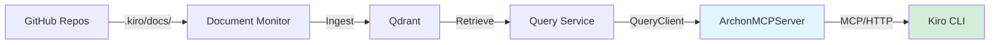

# Overview

## Purpose

ArchonMCPServer is an MCP (Model Context Protocol) server that exposes the Archon RAG system as standardized tools for LLM clients. It enables AI assistants like Kiro CLI, Claude Desktop, and Cursor to retrieve grounded information from internal Archon/Aphex documentation instead of hallucinating assumptions.

## Problem Statement

AI assistants working on platform code need to:
- Understand current architecture and conventions
- Find existing implementations before reinventing
- Generate code that matches established patterns
- Answer questions grounded in actual documentation

Without access to the knowledge base, assistants either:
- Hallucinate plausible but incorrect information
- Ask users to manually provide context
- Generate code that doesn't match platform conventions

## Solution

ArchonMCPServer bridges the gap by:
1. Wrapping the Archon Query Service with MCP-compliant HTTP endpoints
2. Exposing three core tools: search, get_document, list_repos
3. Returning results with full provenance (doc_id, chunk_id, source_path, repo, score)
4. Integrating seamlessly with Kiro via `.kiro/steering/archon-rag.md`

## Key Features

- **Standardized Protocol**: Implements MCP so any MCP-compatible client can use it
- **Grounded Retrieval**: Returns citations and provenance with every result
- **Minimal Overhead**: Thin FastAPI wrapper around existing QueryClient
- **Kubernetes-Native**: Designed for deployment alongside Query Service
- **Automatic Integration**: Works with ArchonKiroTemplate steering out of the box

## Use Cases

### For Kiro CLI Users

When working on Archon/Aphex platform code, Kiro automatically:
- Searches documentation before answering architecture questions
- Retrieves examples before generating manifests or controllers
- Cites sources when explaining current patterns
- Explicitly states when information cannot be verified

### For Platform Engineers

- Ask "How do I deploy a new service?" → Get actual deployment docs with citations
- Ask "What's the current vLLM version?" → Get accurate version from ArchonAgent docs
- Generate CRDs → Kiro retrieves existing examples first
- Troubleshoot issues → Kiro grounds advice in operations documentation

### For Documentation Maintenance

- Verify documentation coverage by checking search results
- Identify gaps when queries return no results
- Test retrieval quality before deploying doc updates

## System Context

ArchonMCPServer is part of the Archon RAG ecosystem:



**Upstream Dependencies:**
- Query Service (port 8080) - provides retrieval API
- Qdrant 1.16.3 - vector database with 768-dim embeddings
- AphexServiceClients - Python client library

**Downstream Consumers:**
- Kiro CLI - primary consumer via archon-rag.md steering
- Claude Desktop - can be configured to use MCP server
- Cursor - can be configured to use MCP server

## Technology Stack

- **Python 3.11+** - Runtime
- **FastAPI** - HTTP server framework
- **Uvicorn** - ASGI server
- **AphexServiceClients** - Query Service client with retry logic
- **Pydantic** - Request/response validation

## Archon Integration

This repository is ingested by the **Archon** RAG system, which reads all Markdown files under `.kiro/docs/` to build mental models for sourcing code and architectural information.

Documentation in this repository follows the Archon documentation contract defined in `CLAUDE.md` at the repo root.

## Quick Start

```bash
# Install dependencies
pip install -e .

# Run server
python -m archon_mcp

# Server runs on http://localhost:8090
```

See `operations.md` for deployment instructions.

## Key Concepts

**MCP (Model Context Protocol)**: Standardized protocol for LLM clients to discover and invoke tools. Defines `/mcp/tools/list` and `/mcp/tools/call` endpoints.

**Tool**: A function that an LLM can invoke, defined with name, description, and JSON schema for inputs.

**Provenance**: Metadata about where information came from (doc_id, chunk_id, source_path, repo, score).

**Grounding**: Basing responses on retrieved evidence rather than model knowledge.

**Source**
- `src/archon_mcp/` - Implementation
- `pyproject.toml` - Dependencies
- `.kiro/steering/archon-rag.md` - Integration guidance

## Related Repositories

[List related repositories and their relationships]

**Source**
- `CLAUDE.md`
- `.kiro/steering/archon-docs.md`
