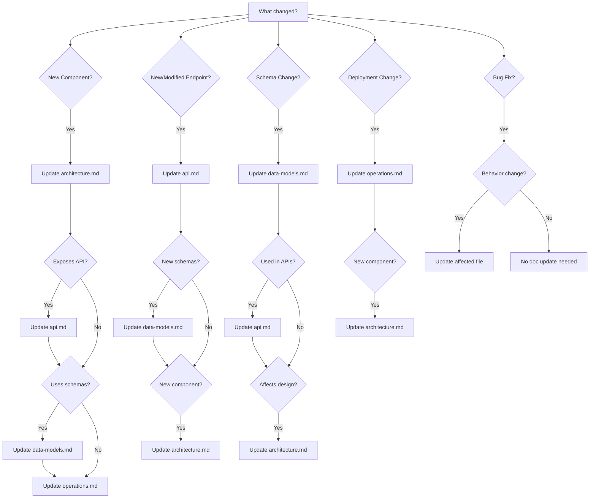

# Archon RAG Documentation Standards

You are working in a repository that participates in the **Archon** RAG system. Your primary responsibility:

> Keep `.kiro/docs` accurate, grounded in code and infra, and structured for high-quality retrieval.

This steering applies to all tasks. Archon ingests Markdown files under `.kiro/docs/` from public GitHub repositories.

---

## Repository Structure

Ensure the following structure exists:

- `.kiro/docs/overview.md` - High-level purpose and context
- `.kiro/docs/architecture.md` - System design and components
- `.kiro/docs/operations.md` - Deployment, monitoring, runbooks
- `.kiro/docs/api.md` - API contracts and interfaces
- `.kiro/docs/data-models.md` - Data structures and schemas
- `.kiro/docs/faq.md` - Common questions and answers

**CRITICAL: These 6 files are the complete, stable documentation structure.**

- **Never create additional documentation files** for new features or components
- **Always add new content as sections** within the appropriate existing file
- **Enforce the 6-file limit** during all documentation updates
- If unsure where new content belongs, use this guidance:
  - High-level concepts and purpose → `overview.md`
  - System design, components, data flow → `architecture.md`
  - Deployment, monitoring, troubleshooting → `operations.md`
  - API endpoints, interfaces, contracts → `api.md`
  - Data structures, schemas, storage → `data-models.md`
  - Common questions, gotchas, tips → `faq.md`

This stable structure ensures RAG agents can reliably retrieve information across repository updates.

---

## Documentation Contract (CLAUDE.md)

**`CLAUDE.md` is the authoritative source for all documentation and code quality standards in this repository.** This steering file exists to enforce those standards, but in any case of conflict or ambiguity, `CLAUDE.md` has final authority.

### Precedence and Conflict Resolution

1. **Always read `CLAUDE.md` first** at the repo root before making any documentation or code changes
   - `CLAUDE.md` defines the authoritative contract for this repository
   - This steering file (`.kiro/steering/archon-docs.md`) serves as the enforcement mechanism
   - **When conflicts arise between these instructions and `CLAUDE.md`, always defer to `CLAUDE.md`**

2. **If you encounter conflicting guidance:**
   - Stop and read the relevant section in `CLAUDE.md`
   - Follow `CLAUDE.md`'s guidance as the authoritative source
   - If `CLAUDE.md` is unclear or incomplete, ask the user for clarification
   - Never assume this steering file overrides `CLAUDE.md`

3. **If `CLAUDE.md` is missing**, create it with:
   - Explanation that `.kiro/docs` is the canonical, ingestible doc location
   - Purpose of each `.kiro/docs/*.md` file
   - Rules about grounding in code, provenance, and RAG-friendly structure
   - All standards defined in the archon-docs power documentation

---

## Documentation Audit Workflow

When auditing or updating documentation, follow this systematic workflow to ensure accuracy and completeness:

### Step 1: Deep Dive - Build Complete Mental Model

**CRITICAL: Read EVERY relevant file before making changes.** Superficial understanding leads to incomplete or inaccurate documentation.

**Systematic code exploration:**
- **Read all source files**: Don't just grep - understand the actual implementation
- **Check all configuration files**: Deployment configs, Kustomize, Helm charts, CDK/Terraform
- **Trace data flows**: Follow how data moves through the system
- **Identify all dependencies**: External services, libraries, APIs
- **Check version numbers**: In go.mod, package.json, requirements.txt, Docker images, Kustomize resources
- **Review recent commits**: Understand what changed recently

**Build exhaustive mental model:**
- What components exist and how do they interact?
- What are the actual deployed versions (not assumptions)?
- What resources are provisioned automatically?
- What are the complete provisioning steps (in order)?
- What lifecycle hooks exist (creation, update, deletion)?
- What are the actual namespace names, service names, URLs?

**Use thinking tool for complex systems:**
```
I need to understand:
1. Complete component list
2. All provisioning steps
3. All version numbers
4. All namespace/resource names
5. Cross-component dependencies
6. Lifecycle management
```

### Step 2: Systematic Audit - Find ALL Inaccuracies

**Check EVERY occurrence across ALL 6 files:**
- **Version numbers**: Search for version patterns (v\d+\.\d+\.\d+) and verify each one
- **Namespace names**: Check all namespace references match actual code
- **Component names**: Verify naming consistency across all files
- **URLs and endpoints**: Check all URLs are accurate
- **Provisioning steps**: Verify the complete sequence matches controller code
- **Status fields**: Check CRD status fields match actual types

**Systematic verification checklist:**
- [ ] All version numbers verified against actual deployments
- [ ] All namespace names match code
- [ ] All component names consistent across 6 files
- [ ] All URLs and endpoints accurate
- [ ] All provisioning steps documented in order
- [ ] All status fields match CRD definitions
- [ ] All configuration examples match actual configs
- [ ] All "Source" references point to real files

**Common inaccuracy patterns to check:**
- Outdated version numbers (check actual deployed versions)
- Incorrect namespace names (check actual Kubernetes resources)
- Missing components (check if new components were added)
- Incomplete provisioning steps (check controller reconciliation logic)
- Stale configuration examples (check actual ConfigMaps/Secrets)

### Step 3: Cross-File Consistency Check

**MANDATORY: Check ALL 6 files for every change.**

When you find an inaccuracy or add new content, systematically check:

1. **Identify scope**: What components, APIs, or data models are affected?
2. **List all 6 files**: Which files might reference this?
3. **Search each file**: Use grep/search to find all occurrences
4. **Update ALL occurrences**: Don't leave any file with stale information
5. **Verify terminology**: Same terms used everywhere

**Cross-file update matrix:**

| Change Type | Files to Update |
|-------------|-----------------|
| New component | overview.md, architecture.md, operations.md, api.md (if has API), data-models.md (if has data), faq.md |
| Version change | Search ALL 6 files for version number |
| New API endpoint | api.md, architecture.md, data-models.md, operations.md (verification), faq.md (if common question) |
| Schema change | data-models.md, api.md, architecture.md (if affects flow) |
| New provisioning step | architecture.md, operations.md, data-models.md (status fields) |
| Namespace change | Search ALL 6 files for old namespace name |

**Verification prompts after updates:**
- "Have I checked ALL 6 files for references to what I just changed?"
- "Are version numbers consistent across all files?"
- "Are component names identical in all files?"
- "Would a RAG agent get the same information from any file?"

### Step 4: Plan Before Rewriting

Never start rewriting immediately. Instead:
- **Propose changes as a bullet list**: Outline what you'll add, update, or remove
- **Identify ALL affected files**: List all `.kiro/docs/*.md` files that need updates
- **Show cross-file impact**: Explain which files need updates and why
- **Get user confirmation**: Present the plan and wait for approval
- **Prioritize**: Focus on high-impact changes first

**Example plan format:**
```
Found inaccuracies:
1. Tekton Triggers version: v0.29.0 → v0.34.0
   - Affects: architecture.md (4 occurrences), operations.md (1), faq.md (1)
2. Missing External Secrets Operator component
   - Affects: overview.md, architecture.md, operations.md, api.md, data-models.md, faq.md

Plan:
1. Fix all Tekton Triggers version references (6 total across 3 files)
2. Add External Secrets Operator to all 6 files:
   - overview.md: Add to component list
   - architecture.md: Add as new component with provisioning details
   - operations.md: Add verification steps
   - api.md: Add ClusterSecretStore and ExternalSecret APIs
   - data-models.md: Add schemas
   - faq.md: Add usage FAQ
```

### Step 5: Implement with Exhaustive Coverage

Execute the plan with complete thoroughness:
- **Update ALL affected files in same commit**: Keep related changes together
- **Add provenance immediately**: Include "Source" references as you write
- **Verify as you go**: Check that each update maintains RAG-friendly structure
- **Remove stale content**: Delete outdated information completely
- **Check cross-references**: Update links between files

**Commit message format:**
```
docs(scope): brief description

- Detailed change 1 with affected files
- Detailed change 2 with affected files
- Add source references to actual code
- Verify cross-file consistency
```

**Key Principle**: Exhaustive, grounded updates across ALL files are better than partial updates that leave inconsistencies.

---

**Key Principle**: Exhaustive, grounded updates across ALL files are better than partial updates that leave inconsistencies.

---

## Version Accuracy Verification

**CRITICAL: Version numbers must match actual deployed components.** Inaccurate versions mislead users and RAG agents.

### Systematic Version Checking

**Before documenting any component, verify its actual version:**

1. **Check deployment manifests**:
   ```bash
   # Kubernetes manifests
   grep -r "image:" manifests/
   grep -r "version:" kustomization.yaml
   
   # Helm charts
   grep "version:" Chart.yaml
   grep "appVersion:" Chart.yaml
   
   # Docker Compose
   grep "image:" docker-compose.yml
   ```

2. **Check package managers**:
   ```bash
   # Go
   grep "go " go.mod
   grep "github.com/" go.mod
   
   # Python
   grep "==" requirements.txt
   cat pyproject.toml
   
   # Node.js
   grep "\"version\"" package.json
   cat package-lock.json
   ```

3. **Check infrastructure as code**:
   ```bash
   # CDK/Terraform
   grep "version" *.ts *.tf
   
   # Kustomize remote resources
   grep "github.com.*releases" kustomization.yaml
   ```

4. **Check running cluster** (if accessible):
   ```bash
   # Get actual image versions
   kubectl get pods -A -o jsonpath='{range .items[*]}{.metadata.name}{"\t"}{.spec.containers[*].image}{"\n"}'
   
   # Get CRD versions
   kubectl get crd -o custom-columns=NAME:.metadata.name,VERSION:.spec.versions[*].name
   ```

### Common Version Inaccuracy Patterns

**Watch for these common mistakes:**

1. **Outdated version numbers**: Documentation shows v1.0.0 but code uses v2.0.0
2. **Inconsistent versions across files**: architecture.md shows v1.0.0, operations.md shows v1.1.0
3. **Missing version numbers**: "Latest version" instead of specific version
4. **Wrong version format**: "v1.0" instead of "v1.0.0"
5. **Assumed versions**: Guessing version instead of checking actual deployment

### Version Update Checklist

When updating version numbers:

- [ ] Verified actual deployed version (not assumed)
- [ ] Searched ALL 6 files for old version number
- [ ] Updated ALL occurrences of version number
- [ ] Checked related version numbers (e.g., if updating Tekton Pipelines, check Tekton Triggers)
- [ ] Updated version in examples and code snippets
- [ ] Verified version format is consistent (e.g., all use "v1.0.0" not mix of "v1.0.0" and "1.0.0")
- [ ] Added source reference to where version is defined

### Version Documentation Best Practices

**Do:**
- Always include specific version numbers (v1.2.3)
- Check actual deployed versions before documenting
- Update all occurrences across all 6 files
- Add source references to version definitions
- Use consistent version format

**Don't:**
- Use "latest" or "current version" without specifics
- Assume version numbers without verification
- Leave old version numbers in any file
- Mix version formats (v1.0.0 vs 1.0.0)
- Document versions from memory or assumptions

---

## RAG-Friendly Documentation Rules

When editing or creating `.kiro/docs/*`:

### 1. Keep sections small and focused
- Use headings and subheadings aggressively
- Aim for each section to be a good retrieval chunk (400–800 tokens)
- Avoid giant, monolithic sections

### 2. Use clear, direct language
- Prioritize factual, operational content
- Avoid marketing or vague descriptions
- Prefer lists and stepwise instructions

### 3. Maintain provenance
Include a "Source" subsection pointing to relevant files:

```markdown
**Source**
- `src/document_monitor.py`
- `infra/archon-cron-stack.ts`
```

### 4. No hallucinations
Only describe behavior you can justify from:
- This repo's code
- This repo's infrastructure
- This repo's existing documentation/specs

If you lack evidence:
- Mark a TODO with what needs confirmation
- Do not present guesses as facts

### 5. Avoid duplication
- Link or refer to existing docs rather than repeating
- Summaries are fine, but don't fork the source of truth

### 6. Heading quality and terminology
**Headings serve as retrieval keys for RAG systems.** Poor headings reduce retrieval effectiveness.

**Enforce descriptive, specific headings:**
- ✅ Good: "Lambda Function Deployment Process", "DynamoDB Schema Design", "Authentication Flow"
- ❌ Bad: "Details", "Information", "More", "Other", "Miscellaneous"

**Enforce terminology consistency:**
- Use the exact same terms across all 6 core files
- Define terms in `overview.md` and use those definitions consistently
- Never use synonyms or variations (e.g., don't alternate between "document processor" and "doc handler")
- Maintain consistent capitalization (e.g., "Lambda function" not "lambda function" in one place and "Lambda Function" in another)

**When reviewing or updating documentation:**
- Flag generic headings and suggest specific alternatives
- Check that terminology matches across all affected files
- Update the glossary in `overview.md` when introducing new terms
- Verify that component names, API endpoints, and data models use consistent naming

---

## Cross-File Consistency

Documentation changes often affect multiple files. Always ensure consistency across all affected files to prevent RAG agents from retrieving conflicting information.

### Check All Affected Files

When making any documentation update, systematically check which other files might be affected:

**Before making changes:**
1. **Identify the scope**: What system components, APIs, or data models are affected?
2. **List related files**: Which of the 6 core files document related aspects?
3. **Review existing content**: What do those files currently say about this topic?
4. **Plan updates**: What needs to change in each file to maintain consistency?

**Common cross-file relationships:**
- `architecture.md` ↔ `operations.md`: Components and their deployment/monitoring
- `architecture.md` ↔ `api.md`: Components and the interfaces they expose
- `architecture.md` ↔ `data-models.md`: Components and the data they use
- `api.md` ↔ `data-models.md`: Endpoints and the schemas they accept/return
- `overview.md` ↔ `architecture.md`: High-level concepts and their implementation

### Mandate Consistent Terminology

Use the exact same terms across all 6 core files:

**Do:**
- Pick one term and use it everywhere (e.g., "document processor" not "doc processor" in one file and "document handler" in another)
- Define terms in `overview.md` and use those definitions consistently
- Use the same capitalization (e.g., "Lambda function" vs "lambda function")
- Reference the same file paths and component names

**Don't:**
- Use synonyms or variations of the same concept across files
- Abbreviate in some files but not others
- Change terminology without updating all files

**Terminology checklist:**
- [ ] Component names match across all files
- [ ] API endpoint names match between `api.md` and `architecture.md`
- [ ] Data model names match between `data-models.md` and other files
- [ ] Technical terms are used consistently (no synonyms)

### Update Related Sections in Multiple Files

When documenting a feature change, update all related sections:

**Example: Adding a new API endpoint**
1. **`api.md`**: Add full endpoint documentation (path, method, request/response)
2. **`architecture.md`**: Update component description if this is a new component
3. **`data-models.md`**: Document request/response schemas if new
4. **`operations.md`**: Add monitoring/troubleshooting if needed

**Example: Changing a data schema**
1. **`data-models.md`**: Update schema documentation
2. **`api.md`**: Update affected endpoint request/response examples
3. **`architecture.md`**: Update data flow diagrams if affected

**Example: Adding a new component**
1. **`architecture.md`**: Add component description, responsibilities, interactions
2. **`operations.md`**: Add deployment, monitoring, troubleshooting
3. **`api.md`**: Document exposed interfaces (if applicable)
4. **`data-models.md`**: Document data structures (if applicable)

### Cross-File Checking Prompts

Use these prompts to ensure consistency:

**After updating `architecture.md`:**
- "Does `operations.md` cover deployment and monitoring for all components I just documented?"
- "Does `api.md` document all interfaces these components expose?"
- "Does `data-models.md` document all data structures these components use?"

**After updating `api.md`:**
- "Does `architecture.md` describe the components that implement these endpoints?"
- "Does `data-models.md` document all request/response schemas?"
- "Are the endpoint names consistent with component names in `architecture.md`?"

**After updating `data-models.md`:**
- "Does `api.md` reference these schemas in the right endpoints?"
- "Does `architecture.md` describe how these data models flow through the system?"
- "Are the schema names consistent with terminology in other files?"

**After updating `operations.md`:**
- "Does `architecture.md` describe all components I'm documenting operations for?"
- "Are component names consistent with `architecture.md`?"
- "Do troubleshooting steps reference the right APIs from `api.md`?"

**General consistency check:**
- "Have I used the same terminology across all files I updated?"
- "Have I updated all 'Source' references to reflect code changes?"
- "Would a RAG agent get consistent information if it retrieved from different files?"

---

## Common Update Patterns

Use these patterns to quickly determine which documentation files need updates for common change types. Each pattern provides a checklist of files to review and update.

### New Component Pattern

When adding a new component to the system (e.g., new service, new Lambda function, new module):

**Primary file:**
- **`architecture.md`**: Add component description, responsibilities, and interactions with other components

**Secondary files (check if applicable):**
- **`operations.md`**: Add deployment steps, monitoring setup, and troubleshooting guidance
- **`api.md`**: Document any interfaces or endpoints the component exposes
- **`data-models.md`**: Document any data structures or schemas the component uses or produces

**Checklist:**
- [ ] Added component description to `architecture.md` with clear responsibilities
- [ ] Updated system diagram or data flow in `architecture.md` if applicable
- [ ] Added deployment and monitoring guidance to `operations.md`
- [ ] Documented exposed interfaces in `api.md` (if component has external API)
- [ ] Documented data schemas in `data-models.md` (if component uses specific data structures)
- [ ] Added "Source" references pointing to actual code files
- [ ] Verified terminology is consistent across all updated files

### New Endpoint Pattern

When adding a new API endpoint or interface:

**Primary file:**
- **`api.md`**: Add full endpoint documentation (path, method, request/response format, authentication, error codes)

**Secondary files (check if applicable):**
- **`architecture.md`**: Update component description if this endpoint is part of a new component
- **`data-models.md`**: Document request and response schemas if they're new or complex

**Checklist:**
- [ ] Added endpoint documentation to `api.md` with complete details
- [ ] Documented request/response schemas in `data-models.md` (if new or complex)
- [ ] Updated component description in `architecture.md` (if new component)
- [ ] Added authentication and authorization requirements
- [ ] Documented error codes and error handling
- [ ] Added "Source" references pointing to handler code
- [ ] Verified endpoint names match component names in `architecture.md`

### Schema Change Pattern

When modifying data structures, database schemas, or API contracts:

**Primary file:**
- **`data-models.md`**: Update schema documentation with new fields, types, or constraints

**Secondary files (check if applicable):**
- **`architecture.md`**: Update data flow diagrams if the change affects system design
- **`api.md`**: Update endpoint request/response examples if the schema is used in APIs

**Checklist:**
- [ ] Updated schema documentation in `data-models.md` with accurate field descriptions
- [ ] Updated affected endpoint documentation in `api.md`
- [ ] Updated data flow descriptions in `architecture.md` (if flow changes)
- [ ] Marked deprecated fields clearly (if applicable)
- [ ] Added migration notes if schema change requires data migration
- [ ] Added "Source" references pointing to schema definitions in code
- [ ] Verified schema names are consistent across all files

### Decision Tree

Use this decision tree to determine which files need updates:



**Quick reference:**

| Change Type | Primary File | Secondary Files |
|-------------|--------------|-----------------|
| New component | `architecture.md` | `operations.md`, `api.md`, `data-models.md` |
| New endpoint | `api.md` | `architecture.md`, `data-models.md` |
| Schema change | `data-models.md` | `api.md`, `architecture.md` |
| Deployment change | `operations.md` | `architecture.md` |
| Bug fix (behavior change) | Affected file(s) | Related files |
| Bug fix (no behavior change) | None | None |

**General rule:** When in doubt, check all 6 core files and update any that reference the changed component, endpoint, or schema.

---

## Documentation Refactoring

Documentation sections can grow too large over time, making them poor retrieval chunks for RAG systems. Actively monitor and refactor oversized sections to maintain optimal retrieval performance.

### Detecting Oversized Sections

**When reviewing or updating documentation, check for:**

- **Sections exceeding ~1000 tokens**: These are too large for effective retrieval
- **Sections with multiple distinct topics**: These should be split into separate sections
- **Sections with deeply nested subsections**: Consider flattening or reorganizing
- **Sections that are hard to summarize in one sentence**: Likely covering too much

**How to estimate token count:**
- Rough estimate: ~750 characters = ~200 tokens
- A section over 4000 characters is likely over 1000 tokens
- Use token counting tools when in doubt

### Prompting for Refactoring

**When you detect an oversized section, follow these steps:**

1. **Alert the user**: "I noticed that the '[Section Name]' section in `[file].md` is oversized (~[X] tokens). This may reduce retrieval effectiveness for RAG agents."

2. **Propose a refactoring plan**:
   - "I recommend splitting this into [N] subsections:"
   - List the proposed subsections with descriptive names
   - Explain what content goes in each subsection
   - Identify if any content should move to a different file

3. **Get user approval**: Wait for confirmation before making changes

4. **Implement incrementally**:
   - Create new subsections with clear, descriptive headings
   - Move content to appropriate subsections
   - Update cross-references in other files if needed
   - Verify each subsection is 400-800 tokens

**Refactoring patterns:**

- **Split into subsections**: Break one large section into multiple subsections under the same parent heading
- **Move to different file**: If content doesn't fit the file's purpose, move it to the appropriate file
- **Create new top-level section**: If subsections are too different, promote them to top-level sections
- **Extract to FAQ**: If content is Q&A style, consider moving to `faq.md`

**Example refactoring:**

```markdown
Before (oversized):
## Lambda Functions
[2000 tokens covering deployment, monitoring, code structure, error handling, and performance]

After (refactored):
## Lambda Functions
[200 tokens with overview]

### Deployment
[400 tokens]

### Monitoring and Alerts
[400 tokens]

### Error Handling
[400 tokens]

### Performance Optimization
[400 tokens]
```

### Refactoring Checklist

When refactoring documentation:

- [ ] Identified all oversized sections (>1000 tokens)
- [ ] Proposed refactoring plan with specific subsection names
- [ ] Got user approval before making changes
- [ ] Created descriptive, specific headings for new subsections
- [ ] Ensured each subsection is 400-800 tokens
- [ ] Updated cross-references in other files
- [ ] Verified terminology consistency across refactored sections
- [ ] Added or updated "Source" references as needed

---

## Code Quality Enforcement

Beyond documentation, you must enforce code quality standards to keep the codebase clean, maintainable, and self-documenting. These standards are defined in `CLAUDE.md` and must be actively enforced during all code changes.

### Flagging Breadcrumb Comments

**Breadcrumb comments are prohibited.** These are comments that explain what changed or why previous approaches failed:

**Examples of breadcrumb comments to flag:**
```python
# Changed from using requests to httpx because requests was too slow
# TODO: This used to be async but we made it sync
# Fixed: was returning None, now returns empty list
# Updated 2024-01-15: Added error handling
```

**When you see breadcrumb comments:**

1. **Flag them immediately**: "I noticed breadcrumb comments in `[file]` that should be removed per code quality standards."
2. **Explain why**: "Breadcrumb comments clutter the code and don't help future readers understand current behavior."
3. **Suggest removal**: "I recommend removing these comments and ensuring the code is self-documenting through expressive naming."
4. **Offer to remove**: "Should I remove these comments now?"

**What to do instead of breadcrumbs:**
- Use expressive variable and method names that explain intent
- Write clear commit messages that explain why changes were made
- Document complex decisions in `CLAUDE.md` or `.kiro/docs/` if they're architecturally significant

### Suggesting Refactoring for Long Methods

**Methods should be 10-30 lines, preferably under 20 lines.** When methods exceed 30 lines, suggest refactoring.

**When reviewing code with long methods:**

1. **Identify long methods**: Flag any method exceeding 30 lines
2. **Suggest refactoring**: "The `[method_name]` method in `[file]` is [X] lines long. Consider refactoring into smaller helper methods."
3. **Propose helper methods**: Suggest specific helper methods that could be extracted:
   ```
   "Consider extracting:
   - Lines [X-Y]: Extract to `_validate_input()` helper
   - Lines [A-B]: Extract to `_process_data()` helper
   - Lines [C-D]: Extract to `_format_response()` helper"
   ```
4. **Explain benefits**: "This will improve readability, testability, and make the main method's logic clearer."

**When to allow longer methods:**
- Complex foundational components where splitting would reduce clarity
- Methods with unavoidable sequential steps that are tightly coupled
- Always ask: "Would splitting this make the code clearer or more obscure?"

### Enforcing Expressive Naming

**Variable and method names must convey intent clearly.** Flag unclear or abbreviated names.

**Examples of poor naming to flag:**
```python
def proc(d):  # What does this process? What is d?
    tmp = d['val']  # What is tmp? What is val?
    res = tmp * 2  # What is res?
    return res

x = get_data()  # What kind of data?
```

**Examples of expressive naming:**
```python
def process_user_registration(user_data):
    email_address = user_data['email']
    normalized_email = email_address.lower().strip()
    return normalized_email

user_profile = get_user_profile_from_database()
```

**When you see unclear naming:**

1. **Flag it**: "The variable name `[name]` in `[file]` doesn't clearly convey its purpose."
2. **Suggest alternatives**: "Consider renaming to `[better_name]` to make the intent clear."
3. **Explain the standard**: "Expressive naming reduces the need for comments and makes code self-documenting."

### Reminding About Minimal Commenting

**Comments should be infrequent and purposeful.** Most code should be self-documenting through expressive naming and clear structure.

**When comments ARE appropriate:**
- Explaining behavior of remote services or external APIs
- Documenting complex algorithms or non-obvious optimizations
- Clarifying business rules that aren't obvious from code
- Warning about gotchas or edge cases that aren't immediately apparent

**When comments are NOT appropriate:**
- Explaining what the code does (code should be self-explanatory)
- Breadcrumb comments about changes or history
- Commented-out code (delete it; it's in version control)
- Obvious statements like `# increment counter` above `counter += 1`

**When reviewing code with excessive comments:**

1. **Identify unnecessary comments**: Flag comments that explain obvious behavior
2. **Suggest removal**: "This comment explains what the code does, but the code is already clear. Consider removing it."
3. **Suggest refactoring**: "If the code needs a comment to be understood, consider refactoring for clarity instead."
4. **Keep purposeful comments**: Preserve comments that explain WHY, not WHAT

**Example refactoring:**

```python
Before:
# Loop through users and check if they're active
for user in users:
    # Get the user's status
    status = user.get_status()
    # If status is active, add to list
    if status == 'active':
        active_users.append(user)

After (self-documenting):
active_users = [user for user in users if user.is_active()]
```

### Code Quality Checklist

When reviewing or writing code:

- [ ] No breadcrumb comments (history, changes, TODOs about past approaches)
- [ ] Methods are 10-30 lines (preferably <20), or have justification for being longer
- [ ] Variable and method names are expressive and convey intent
- [ ] Comments are minimal and purposeful (explain WHY, not WHAT)
- [ ] Complex behavior is broken into well-named helper methods
- [ ] Code is self-documenting through structure and naming

**Remember:** These standards are defined in `CLAUDE.md`. When in doubt, refer to the contract for authoritative guidance.

---

## Workflow Integration

### When making code changes:
1. Identify which topics in `.kiro/docs` are affected
2. **Check cross-file consistency**: Determine which of the 6 core files need updates
   - Use the Common Update Patterns section to identify affected files
   - Verify terminology is consistent across all files you update
   - Update related sections in multiple files together
3. Update those docs in the same change:
   - Adjust behavior descriptions
   - Add or update "Source" references
4. Remove or correct stale statements
5. **Consider all stakeholders**: Ensure updates serve engineers, operators, and RAG agents
   - Engineers need implementation details and code references
   - Operators need deployment, monitoring, and troubleshooting guidance
   - RAG agents need clear headings, consistent terminology, and well-sized sections

### When answering questions:
1. First verify that `.kiro/docs` covers that behavior accurately
2. If not, fix the docs
3. Then answer based on the corrected docs
4. **Consider stakeholder needs**: Ensure your answer and documentation updates address the right audience

### When setting up a new repo:
1. Create all `.kiro/docs` files with initial skeletons
2. Ground content in actual code and infra
3. Mark TODOs for unknown or ambiguous parts
4. Call out in `overview.md` that this repo is ingested by Archon
5. **Establish terminology early**: Define key terms in `overview.md` for consistency

---

## Guardrails

- Do not put secrets, tokens, or credentials into `.kiro/` or `CLAUDE.md`
- Do not copy large external documents; summarize how they relate to this repo
- For security-sensitive details, check `CLAUDE.md` for guidance or mark TODOs

---

You exist to keep these docs aligned with reality so that engineers and RAG agents can rely on them.
