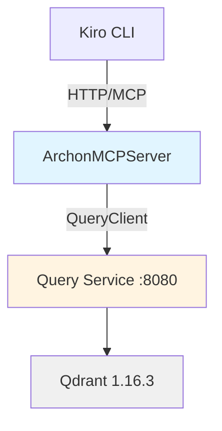

# ArchonMCPServer

MCP (Model Context Protocol) server for the Archon RAG system. Exposes Archon's knowledge base as standardized tools that LLM clients (Kiro, Claude Desktop, Cursor) can discover and invoke for grounded decision-making.

## What is This?

ArchonMCPServer wraps the Archon Query Service with an MCP-compliant HTTP API, allowing AI assistants to:
- Search across internal Archon/Aphex documentation
- Retrieve full documents for detailed context
- List available repositories in the knowledge base

This enables **grounded, citation-backed responses** instead of hallucinated assumptions about internal architecture.

## Quick Start

### Local Development

```bash
# Install dependencies
pip install -e .

# Set Query Service URL (optional, defaults to Kubernetes service)
export QUERY_SERVICE_URL=http://localhost:8080

# Run server
python -m archon_mcp
```

Server runs on `http://localhost:8090`

### Docker

```bash
docker build -t archon-mcp-server .
docker run -p 8090:8090 \
  -e QUERY_SERVICE_URL=http://query.archon-knowledge-base:8080 \
  archon-mcp-server
```

### Kubernetes

See `.kiro/docs/operations.md` for deployment instructions.

## Available Tools

### archon.search
Search across internal documentation with ranked results and provenance.

```json
{
  "name": "archon.search",
  "arguments": {
    "query": "How do I deploy a service?",
    "top_k": 5,
    "repo_filter": "AphexPlatformInfrastructure"
  }
}
```

### archon.get_document
Fetch full document text for detailed context.

```json
{
  "name": "archon.get_document",
  "arguments": {
    "doc_id": "uuid-from-search-results"
  }
}
```

### archon.list_repos
List available repositories in the knowledge base.

```json
{
  "name": "archon.list_repos",
  "arguments": {}
}
```

## Integration with Kiro

Kiro CLI automatically uses these tools when the `.kiro/steering/archon-rag.md` steering file is present (included in ArchonKiroTemplate).

The steering ensures Kiro:
- Calls MCP tools before making implementation decisions
- Grounds claims in retrieved passages with citations
- Explicitly states when information cannot be verified

## Architecture

ArchonMCPServer is a thin FastAPI wrapper around `AphexServiceClients.QueryClient`:



See `.kiro/docs/architecture.md` for detailed design.

## Documentation

Complete documentation under `.kiro/docs/`:
- `overview.md` - High-level purpose and context
- `architecture.md` - System design and components
- `operations.md` - Deployment and operational procedures
- `api.md` - MCP protocol and tool schemas
- `data-models.md` - Request/response structures
- `faq.md` - Common questions and troubleshooting

## License

[Add your license]
